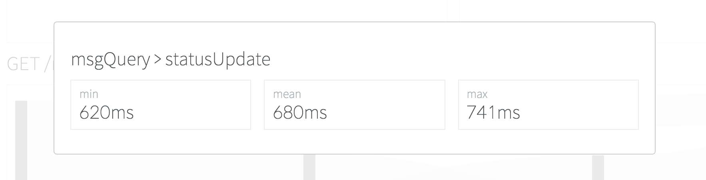
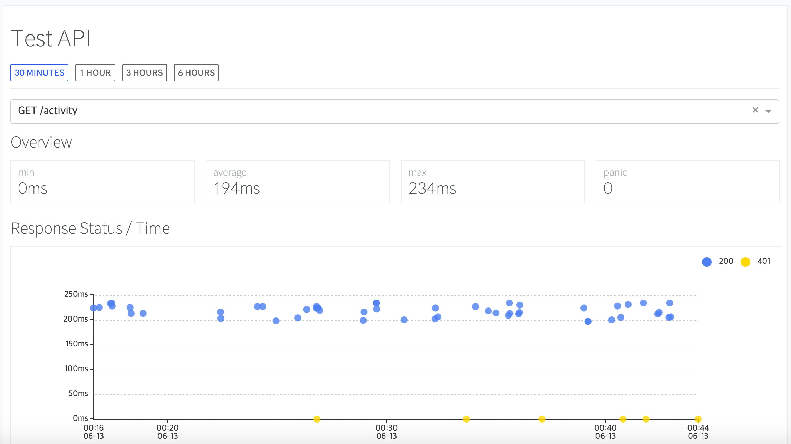

# goni
 [](https://github.com/goniapm/goni/wiki)

Document : [Korean](https://github.com/goniapm/goni/blob/master/README_ko.md)


Goni is an Open Source APM(Application Performance Management) tool for Go

## Overview
- **Dashboard** : By clicking system status heatmap, which is drawn by instance's CPU status or Heap Usage(Coming soon), you can check User, Top 5 Instance, Top 5 Transaction, Transaction detail on specific time.


- **Transaction Trace** : There is a limit for getting `CallStack` in Go, so Goni provides `Transaction Trace`. You can check transaction detail with `Sankey Chart`.




- **Metric View** : Goni provides Expvar / Runtime Metric and Transaction Statistics.




- **Notification** : If panic occurred during Transaction processing, or if slow transaction(>3s) is occurred, Goni send a notification to Slack.


## Architecture

* Using [protobuf](https://github.com/google/protobuf) as protocol for communicate Collector(goniplus) between Worker.
* Metric Data is stored to [InfluxDB](https://influxdata.com/), which is optimized for saving `timeseries data`.
* Common data will be saved to [MySQL](https://www.mysql.com/).
* Dashboard uses [React](https://facebook.github.io/react/).


Goni is composed with following projects.
* [**goniplus**](https://github.com/goniapm/goniplus) : Application metric collector
* [**goni-sms**](https://github.com/goniapm/goni-sms) *(development suspended)* : Server instance metric collector
* [**goni-dashboard**](https://github.com/goniapm/goni-dashboard) : Visualize metric from goni-sms / goniplus
* [**goniplus-worker**](https://github.com/goniapm/goniplus-worker) : Metric handler / processor for goniplus
* **goni-mobile** *(Coming soon)* : Dashboard mobile application

## [Quickstart](https://github.com/goniapm/goni/wiki/Quickstart)

## Issue
If you have an issue, problem, question, please upload it to [here](https://github.com/goniapm/goni/issues).

## Contribution
Contribution is always welcomed :D

## Acknowledgement

* This project is advised to Youngsu Son(from [Whatap](https://whatap.io)), and developed during [Software Masetro](http://swmaestro.kr) program.
* We use [Spoqa Han Sans](http://spoqa.github.io/spoqa-han-sans/), and we follows [Spoqa Design Guideline](http://bi.spoqa.com/color.html).

## License
```
The MIT License (MIT)

Copyright (c) 2016 Goni

Permission is hereby granted, free of charge, to any person obtaining a copy
of this software and associated documentation files (the "Software"), to deal
in the Software without restriction, including without limitation the rights
to use, copy, modify, merge, publish, distribute, sublicense, and/or sell
copies of the Software, and to permit persons to whom the Software is
furnished to do so, subject to the following conditions:

The above copyright notice and this permission notice shall be included in all
copies or substantial portions of the Software.

THE SOFTWARE IS PROVIDED "AS IS", WITHOUT WARRANTY OF ANY KIND, EXPRESS OR
IMPLIED, INCLUDING BUT NOT LIMITED TO THE WARRANTIES OF MERCHANTABILITY,
FITNESS FOR A PARTICULAR PURPOSE AND NONINFRINGEMENT. IN NO EVENT SHALL THE
AUTHORS OR COPYRIGHT HOLDERS BE LIABLE FOR ANY CLAIM, DAMAGES OR OTHER
LIABILITY, WHETHER IN AN ACTION OF CONTRACT, TORT OR OTHERWISE, ARISING FROM,
OUT OF OR IN CONNECTION WITH THE SOFTWARE OR THE USE OR OTHER DEALINGS IN THE
SOFTWARE.
```
