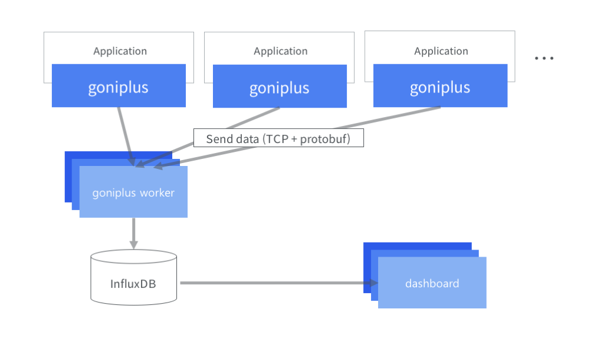

# goni
 [](https://github.com/monitflux/goni/wiki)


Goni는 Go언어를 위한 오픈소스 APM(Application Performance Management) 툴입니다.

## Source code

Goni는 다음 프로젝트들로 이루어져있습니다. 해당 Repository에서 소스코드를 확인하실 수 있습니다.
* [**goniplus**](https://github.com/monitflux/goniplus) : Application 내부에서 Metric을 수집하고, Worker에게 전송하는 Metric Collector입니다.
* [**goni-sms**](https://github.com/monitflux/goni-sms) *(개발 중단)* : Application 외부에서 Metric을 수집하고, Worker에게 전송하는 Metric Collector입니다.
* [**goni-dashboard**](https://github.com/monitflux/goni-dashboard) : goni-sms / goniplus에서 수집한 Metric을 보여주는 Dashboard입니다.
* [**goniplus-worker**](https://github.com/monitflux/goniplus-worker) : goniplus가 전송하는 Metric을 받아서 처리하는 Worker입니다.
* **goni-mobile** *(추후 공개 예정)* : goni-sms / goniplus에서 수집한 Metric을 모바일에서 간단하게 확인할 수 있는 Application입니다.

## Overview
- **Dashboard** : 시간대별 Instance의 CPU *(Linux만 지원)* / Heap *(추후 지원 예정)* 사용량 히트맵을 클릭하면, 그 시간대의 User, Top 5 Instance, Top 5 Transaction, Transaction Detail을 보여줍니다.


- **Transaction Trace** : Go언어에서 `CallStack`을 가져오는데 한계가 있어, `CallStack`을 대체할 Transaction Trace 기능을 제공합니다. 이 기능을 통해 요청이 들어왔을 때 부터, 요청이 완료될 때 까지의 상태를 `Sankey Chart`로 보여줍니다.


- **Metric View** : Expvar / Runtime Metric 뿐만 아니라, 요청에 대한 다양한 Metric을 제공합니다.


- **Notification** : Transaction 처리 도중 Panic이 발생하거나, Slow Transaction(응답시간 3초 이상)이 발생한 경우 Slack으로 Notification을 보내줍니다.


## Architecture

* Collector(goniplus) - Worker 사이의 통신 포맷으로 [protobuf](https://github.com/google/protobuf)를 사용합니다.
* Metric Data는 `timeseries data` 저장에 최적화된 [InfluxDB](https://influxdata.com/)에 저장합니다.
* 일반적인 정보(회원 데이터 / 프로젝트 설정)는 [MySQL](https://www.mysql.com/)에 저장합니다.
* Frontend는 [React](https://facebook.github.io/react/)를 사용합니다.

## [Quickstart](https://github.com/monitflux/goni/wiki/Quickstart)

## Issue
사용시 문제점 / 궁금하신 점이 있으시면 [여기](https://github.com/monitflux/goni/issues)에 이슈를 남겨주세요.

## Contribution
Goni를 개선해주세요! Contribution은 언제나 환영합니다 :D

## Acknowledgement

* 이 프로젝트는 [소프트웨어 마에스트로](http://swmaestro.kr)과정 중 [Whatap](https://whatap.io)의 손영수 멘토님과의 멘토링을 통해 개발된 프로젝트입니다.
* 폰트는 [Spoqa Han Sans](http://spoqa.github.io/spoqa-han-sans/)를 사용하고, Color Scheme은 [Spoqa Design Guideline](http://bi.spoqa.com/color.html)을 참고했습니다.

## License
```
The MIT License (MIT)

Copyright (c) 2016 Goni

Permission is hereby granted, free of charge, to any person obtaining a copy
of this software and associated documentation files (the "Software"), to deal
in the Software without restriction, including without limitation the rights
to use, copy, modify, merge, publish, distribute, sublicense, and/or sell
copies of the Software, and to permit persons to whom the Software is
furnished to do so, subject to the following conditions:

The above copyright notice and this permission notice shall be included in all
copies or substantial portions of the Software.

THE SOFTWARE IS PROVIDED "AS IS", WITHOUT WARRANTY OF ANY KIND, EXPRESS OR
IMPLIED, INCLUDING BUT NOT LIMITED TO THE WARRANTIES OF MERCHANTABILITY,
FITNESS FOR A PARTICULAR PURPOSE AND NONINFRINGEMENT. IN NO EVENT SHALL THE
AUTHORS OR COPYRIGHT HOLDERS BE LIABLE FOR ANY CLAIM, DAMAGES OR OTHER
LIABILITY, WHETHER IN AN ACTION OF CONTRACT, TORT OR OTHERWISE, ARISING FROM,
OUT OF OR IN CONNECTION WITH THE SOFTWARE OR THE USE OR OTHER DEALINGS IN THE
SOFTWARE.
```
